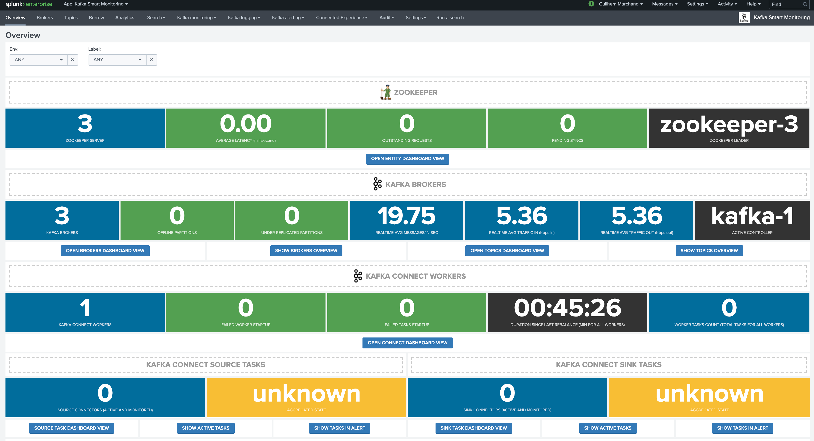

# kafka-demo-cookbook
Kafka Smart Monitoring / Kafka Connect for Splunk demo cookbook

## Tooling

### kafka docker templates (Confluent images and custom pre-built config)

    git clone https://github.com/guilhemmarchand/kafka-docker-splunk.git

### kafka-data-gen

    git clone https://github.com/guilhemmarchand/kafka-data-gen.git

*Note: this is a fork from https://github.com/dtregonning/kafka-data-gen.git with some modification for the purpose of the demo*

## Start the lab environment

**To run a Splunk instance in Docker in the guest:**

    cd kafka-docker-splunk/template_docker_splunk_ondocker/
    for container in zookeeper-1 zookeeper-2 zookeeper-3; do; docker-compose up -d $container; done
    for container in kafka-1 kafka-2 kafka-3; do; docker-compose up -d $container; done
    docker-compose up -d kafka-connect-1
    docker-compose up -d telegraf
    docker-compose up -d splunk

*Optionally:*

    docker-compose up -d kafka-burrow
    docker-compose up -d kafka-monitor

*Confluent Optionally:*

    docker-compose up -d schema-registry
    docker-compose up -d ksql-server
    docker-compose up -d kafka-rest

**To use a Splunk instance running locally or elsewhere:**

    cd kafka-docker-splunk/template_docker_splunk_localhost/

*If the Splunk instance is hosted elsewhere than the host, edit docker-compose.yml and update the HEC target*

    for container in zookeeper-1 zookeeper-2 zookeeper-3; do; docker-compose up -d $container; done
    for container in kafka-1 kafka-2 kafka-3; do; docker-compose up -d $container; done
    docker-compose up -d kafka-connect-1
    docker-compose up -d telegraf

*Optionally:*

    docker-compose up -d kafka-burrow
    docker-compose up -d kafka-monitor

*Confluent Optionally:*

    docker-compose up -d schema-registry
    docker-compose up -d ksql-server
    docker-compose up -d kafka-rest

## Kafka Smart Monitoring app for Splunk

Access the Splunk UI: (if running in Docker / localhost)

http://localhost:8000

Install the Kafka Smart Monitoring app:

https://splunkbase.splunk.com/app/4268/

If Splunk is not running in Docker with provided templates, you can simple install these base config apps to pre-configure an HEC token, indexers and some other configuration items:

https://github.com/guilhemmarchand/kafka-docker-splunk/tree/master/splunk

- TA-docker-kafka
- TA-telegraf-kafka

Once everything is up and running, the UI would show components discovered:



## Prepare kafka-data-gen

Enter the kafka-data-gen directory and run gradle:

```
cd kafka-data-gen
gradle install
```

## Demo 1: ingestion with the HEC event endpoint

The most convenient and the most performing way of ingesting Kafka messages in Splunk is to target the HEC event endpoint.

However, there are strict limitations regarding the date time parsing capabilities, unless specific in a specific format in a specific way, the _time will be equal to the ingestion time in Splunk, often enough this may not be compliant with the requirements. (the time stamp is not accurate, delay in the ingestion would cause even more inaccuracy)

- Generate 1 million of messages in a topic: "kafka_demo"

```
java -jar build/libs/kafka-data-gen.jar -message-count 1000000 -message-size 256 -topic kafka_demo -bootstrap.servers "localhost:19092" -acks all -kafka-retries 0 -kafka-batch-size 60000 -kafka-linger 1 -kafka-buffer-memory 33554432 -eps 0 -output-eventhubs false -output-kafka true -output-stdout false
```

- Create an index in Splunk named "kafka_demo"

- Create a new HEC token, do no specifiy any sourcetype / source and select the default index to be kafka_demo

- Create a new Sink connector:

*modify the HEC target if Splunk is not running in Docker*

*modify the HEC token accordingly*

```json
curl localhost:18082/connectors -X POST -H "Content-Type: application/json" -d '{
"name": "sink-splunk-demo1",
"config": {
   "connector.class": "com.splunk.kafka.connect.SplunkSinkConnector",
   "tasks.max": "1",
   "topics":"kafka_demo",
   "splunk.indexes": "kafka_demo",
   "splunk.sourcetypes": "kafka:gen",
   "splunk.sources": "kafka:west:emea",
   "splunk.hec.uri": "https://splunk:8088",
   "splunk.hec.token": "xxxxxx-xxxx-xxxx-xxxx-xxxxxxxxx",
   "splunk.hec.raw": "false",
   "splunk.hec.ssl.validate.certs": "false"
  }
}'
```

The topic activity will be visible in the Kafka Smart monitoring interface, and data should be ingested in Splunk.

## Demo 2: ingestion with the HEC raw endpoint

- Generate 1 million of messages in a topic: "kafka_demo"

```
java -jar build/libs/kafka-data-gen.jar -message-count 1000000 -message-size 256 -topic kafka_demo -bootstrap.servers "localhost:19092" -acks all -kafka-retries 0 -kafka-batch-size 60000 -kafka-linger 1 -kafka-buffer-memory 33554432 -eps 0 -output-eventhubs false -output-kafka true -output-stdout false
```

- Define a new sourcetype in Splunk (props.conf)

```
[(?::){0}kafka:app:*]
SHOULD_LINEMERGE=false
LINE_BREAKER = (####)
SHOULD_LINEMERGE = false
CHARSET=UTF-8
TIME_PREFIX=\"timestamp\":\"
TIME_FORMAT=%Y-%m-%d %H:%M:%S.%3N
MAX_TIMESTAMP_LOOKAHEAD=30
TRUNCATE=0
```

- Create a new Sink connector:

*modify the HEC target if Splunk is not running in Docker*

*modify the HEC token accordingly*

```json
curl localhost:18082/connectors -X POST -H "Content-Type: application/json" -d '{
"name": "sink-splunk-demo2",
"config": {
   "connector.class": "com.splunk.kafka.connect.SplunkSinkConnector",
   "tasks.max": "1",
   "topics":"kafka_demo",
   "splunk.indexes": "kafka_demo",
   "splunk.sourcetypes": "kafka:gen",
   "splunk.sources": "kafka:west:emea",
   "splunk.hec.uri": "https://splunk:8088",
   "splunk.hec.token": "xxxxxx-xxxx-xxxx-xxxx-xxxxxxxxx",
   "splunk.hec.raw": "true",
   "splunk.hec.raw.line.breaker" : "####",   
   "splunk.hec.ssl.validate.certs": "false"
  }
}'
```

This time the data is ingested using thw raw enedpoint, the events breaking relies on a delimitor created by the Splunk sink connector plugin and the sourcetype definition.

